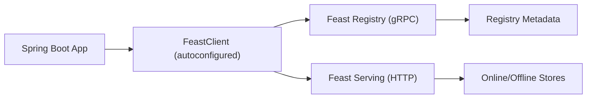

# Spring Boot Starter for Feast (Feature Store)

If you are already using Spring Boot, you should not have to wire gRPC channels, Feign clients, and request models just to talk to Feast. This starter exists so you can drop a single JAR into your classpath, set a handful of properties, and start managing metadata and serving features with an autoconfigured `FeastClient`.

Think of this README as a blog-style walkthrough. It explains the "why," shows a quick setup, and then dives into real usage patterns you can copy into your own Spring Boot app.

**Why this starter exists**

Feast gives you a robust feature store, but the Java integration story can feel like a scavenger hunt: gRPC stubs for the registry, HTTP calls for serving, request shapes, and a lot of wiring. This starter hides those details and gives you a single client and a fluent DSL.

**What you get**

- A Spring Boot auto-configuration that registers a `FeastClient` bean
- A concise DSL for registry operations (entities, data sources, feature views, feature services)
- Serving operations for materialization, push, and online retrieval
- Opinionated defaults with property validation so misconfigurations fail fast

**Architecture in one minute**

- Feast Registry is accessed over gRPC
- Feast Serving is accessed over HTTP
- This starter wires both and exposes them as a single `FeastClient`

---

### Overview

This repository contains the following Feast components.
* Feast Serving: A gRPC service used to serve the latest feature values to models.
* Feast Serving Client: A client used to retrieve features from Feast Serving.

### Architecture

Feast Serving has a dependency on an online store (Redis) for retrieving features. 
The process of ingesting data into the online store (Redis) is decoupled from the process of reading from it.

### Contributing
Guides on Contributing:
- [Contribution Process for Feast](https://docs.feast.dev/v/master/project/contributing)
- [Development Guide for Feast](https://docs.feast.dev/v/master/project/development-guide)
- [Development Guide for feast-java (this repository)](CONTRIBUTING.md)
  - **Note**: includes installing without using Helm

### Installing using Helm
Please see the Helm charts in [infra/charts/feast](../infra/charts/feast).
