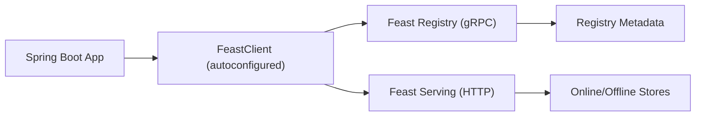

# Spring Boot Starter for Feast (Feature Store)

If you are already using Spring Boot, you should not have to wire gRPC channels, Feign clients, and request models just to talk to Feast. This starter exists so you can drop a single JAR into your classpath, set a handful of properties, and start managing metadata and serving features with an autoconfigured `FeastClient`.

Think of this README as a blog-style walkthrough. It explains the "why," shows a quick setup, and then dives into real usage patterns you can copy into your own Spring Boot app.

**Why this starter exists**

Feast gives you a robust feature store, but the Java integration story can feel like a scavenger hunt: gRPC stubs for the registry, HTTP calls for serving, request shapes, and a lot of wiring. This starter hides those details and gives you a single client and a fluent DSL.

**What you get**

- A Spring Boot auto-configuration that registers a `FeastClient` bean
- A concise DSL for registry operations (entities, data sources, feature views, feature services)
- Serving operations for materialization, push, and online retrieval
- Opinionated defaults with property validation so misconfigurations fail fast

**Architecture in one minute**

- Feast Registry is accessed over gRPC
- Feast Serving is accessed over HTTP
- This starter wires both and exposes them as a single `FeastClient`



---

**Quick Start**

1. Add the starter to your app

If you prefer a direct JAR drop, build it and put it on your app's classpath:

```bash
./mvnw -q -DskipTests install
```

If you publish artifacts to a Maven/Gradle repository, use these coordinates:

```xml
<dependency>
  <groupId>io.github.officiallysingh</groupId>
  <artifactId>spring-boot-starter-feast</artifactId>
  <version>0.0.1-SNAPSHOT</version>
</dependency>
```

```groovy
dependencies {
  implementation "io.github.officiallysingh:spring-boot-starter-feast:0.0.1-SNAPSHOT"
}
```

2. Configure Feast endpoints and project

```yaml
feast:
  enabled: true
  project: feast_demo
  registry:
    host: localhost
    port: 50051
  serving:
    url: http://localhost:6566
```

`feast.project` is required. If you forget it, startup will fail fast because the configuration is validated.

3. Autowire and use `FeastClient`

```java
import com.ksoot.feast.FeastClient;
import feast.proto.types.ValueProto;
import java.time.Duration;
import lombok.RequiredArgsConstructor;
import org.springframework.stereotype.Service;

@Service
@RequiredArgsConstructor
public class FeastBootstrap {

  private final FeastClient feast;

  public void setupRegistry() {
    feast.entity("driver")
        .joinKey("driver_id", ValueProto.ValueType.Enum.INT64)
        .description("Driver entity")
        .apply();

    feast.postgresSqlSource("driver_stats_source")
        .table("driver_stats")
        .eventTimestampField("event_timestamp")
        .createdTimestampField("created")
        .description("Raw driver stats")
        .apply();

    feast.featureView("driver_hourly_stats")
        .entities("driver")
        .features(
            com.ksoot.feast.dto.registry.Feature.of("conv_rate", ValueProto.ValueType.Enum.FLOAT),
            com.ksoot.feast.dto.registry.Feature.of("acc_rate", ValueProto.ValueType.Enum.FLOAT))
        .dataSource("driver_stats_source")
        .ttl(Duration.ofDays(1))
        .online()
        .eventTimestampField("event_timestamp")
        .createdTimestampField("created")
        .description("Hourly driver stats")
        .apply();

    feast.featureService("driver_activity_v1")
        .featureReference("driver_hourly_stats", "conv_rate", "acc_rate")
        .description("Online driver activity features")
        .apply();
  }
}
```

---

**Configuration Reference**

| Property | Default | Required | Description |
| --- | --- | --- | --- |
| `feast.enabled` | `true` | No | Toggle Feast integration |
| `feast.project` | none | Yes | Feast project name |
| `feast.registry.host` | `localhost` | No | Registry gRPC host |
| `feast.registry.port` | `50051` | No | Registry gRPC port |
| `feast.serving.url` | `http://localhost:6566` | No | Serving base URL |

---

**Serving Operations: materialize, push, and online retrieval**

Materialization (full or incremental):

```java
import java.time.OffsetDateTime;

// Full materialization for a time window
feast.materializeFrom(OffsetDateTime.parse("2024-11-01T00:00:00Z"))
    .till(OffsetDateTime.parse("2024-11-30T23:59:59Z"))
    .featureView("driver_hourly_stats")
    .apply();

// Incremental materialization until now
feast.materializeIncrementalTillNow()
    .featureViews("driver_hourly_stats")
    .apply();
```

Push features to online/offline stores:

```java
import com.ksoot.feast.dto.serving.PushFeaturesRequest;

feast.pushTo("driver_stats_push_source")
    .toOnlineAndOffline()
    .feature("driver_id", 1001, 1002)
    .and("event_timestamp", "2024-11-10T12:30:30+00:00", "2024-11-10T12:31:31+00:00")
    .and("created", "2024-11-10T12:30:30Z", "2024-11-10T12:31:31Z")
    .and("conv_rate", 7.7, 7.7)
    .and("acc_rate", 0.9, 0.92)
    .apply();
```

Get online features:

```java
import com.ksoot.feast.dto.serving.OnlineFeatures;

OnlineFeatures features = feast.onlineFeatures("driver_activity_v1")
    .entity("driver_id", 1001, 1002)
    .get();
```

---

**Operational Notes**

- `feast.isServing()` hits `/health` on the Serving API to confirm it is alive.
- If you want detailed HTTP logs for serving calls, increase logging:

```properties
logging.level.com.ksoot.feast.FeastServingFeignClient=DEBUG
```

---

**Closing Thoughts**

This starter is intentionally small: it focuses on a clean Spring Boot experience and a fluent Java API around Feast's registry and serving interfaces. If you already love Feast but want a simpler Java path, this is a solid foundation to build on.

If you want to extend it, look at the DSL classes under `com.ksoot.feast.dsl` and the DTOs under `com.ksoot.feast.dto`. They are designed to be composed and easy to customize.
